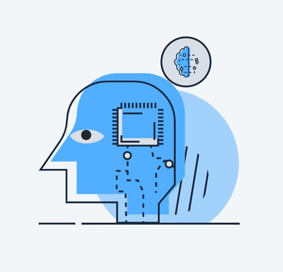
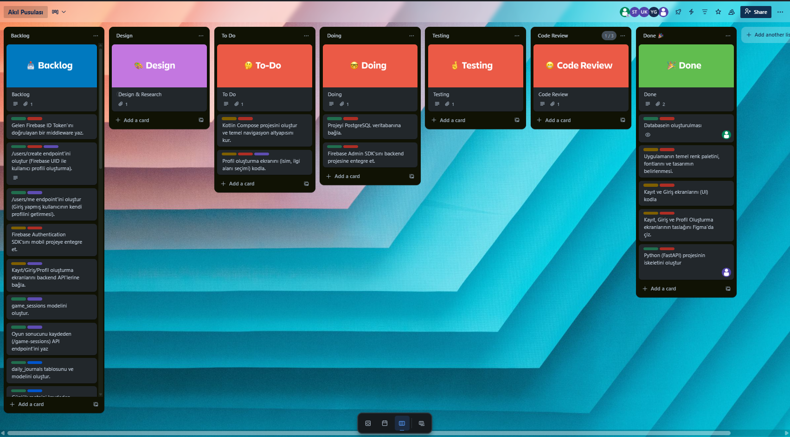
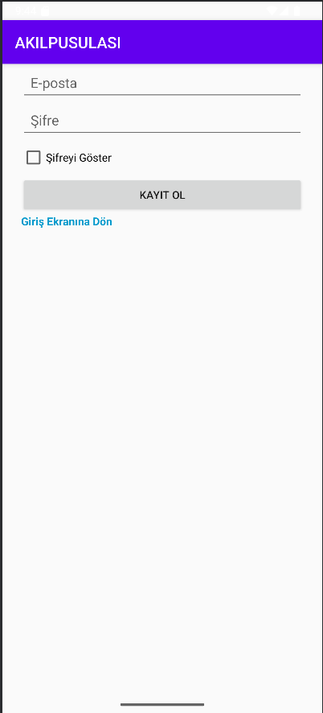
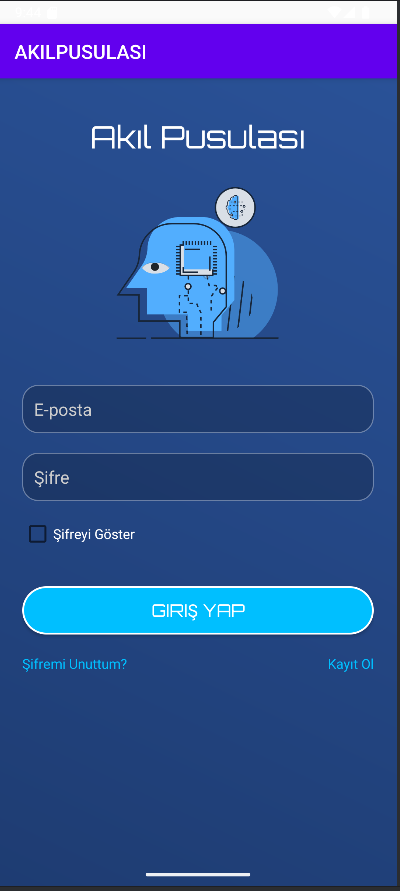
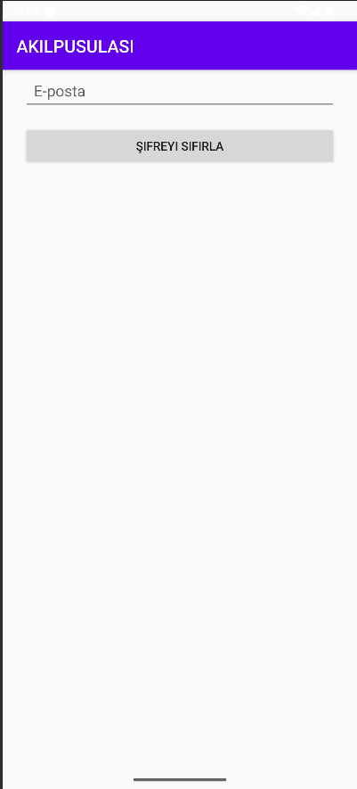
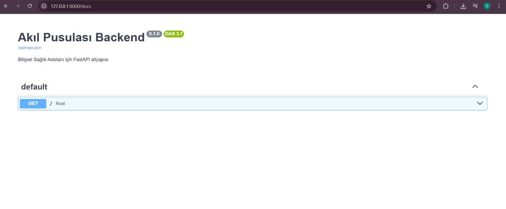

## **Takım İsmi**

**Akıl Pusulası Takımı**

## **Takım Logosu**

## **Takım Üyeleri**
- İsmail Temüroğlu
- Sare Türk  
- Yaren Gülmez  
- Uygar Meriç Kaya  
- Zeynep Çavuş  

## **Proje İsmi**

**Akıl Pusulası - Bilişsel Sağlık Asistanı (MVP) 🧠**

## **Proje Logosu**

## **Proje Açıklaması**

Akıl Pusulası, özellikle yaşlılar ve hafif bilişsel bozukluk yaşayan bireyler için tasarlanmış, **yapay zeka (Gemini) destekli** kişiselleştirilmiş bir bilişsel sağlık asistanıdır.

Bu proje, bir uygulamanın 5 haftalık **Minimum Uygulanabilir Ürün (MVP)** sürümüdür. Temel amacı, yapay zekanın kullanıcının günlük girdilerine (performans ve duygu durum) dayanarak anlamlı ve kişiselleştirilmiş zihin egzersizleri oluşturabileceği hipotezini doğrulamaktır.

## 🚀 Projenin Amacı (MVP)

Bu MVP, "her şeyi biraz yapan" bir uygulama olmak yerine, tek bir temel özelliği mükemmel bir şekilde sergilemeyi hedefler: **Kullanıcı verisine dayalı derinlemesine kişiselleştirme.** Kullanıcının girdiği metin ve oyun skorlarını Gemini AI modeli ile analiz ederek, standart ve tekrarlayan egzersizler yerine, o güne özel, empatik ve ilgi çekici bir zihinsel aktivite sunar.

## ✨ Ana Kısımlar ve Özellikler

MVP sürümü, aşağıdaki temel modüllerden oluşmaktadır:

### 1. Kullanıcı Yönetimi ve Profil Oluşturma

- **Kayıt ve Giriş:** E-posta ve şifre ile güvenli kullanıcı kimlik doğrulaması.
    
- **Basit Profil:** Kullanıcının adını, doğum yılını ve en önemlisi **ilgi alanlarını** (örn: Tarih, Müzik, Sanat, Doğa) seçebildiği bir alan. Bu ilgi alanları, yapay zekanın kişiselleştirme yapması için kritik bir veridir.
    

### 2. Bilişsel Egzersiz: Hafıza Kartları

- Uygulamanın temel performans ölçüm aracı olarak, eşleştirmeye dayalı basit bir hafıza kartı oyunu sunulmaktadır.
    
- **Dinamik Zorluk:** Oyunun zorluk seviyesi (kart sayısı), kullanıcının geçmiş performansına göre basit bir algoritma ile otomatik olarak ayarlanır.
    

### 3. Zihin Günlüğü (Journaling)

- Kullanıcının her gün, "Bugün nasıldı?" veya "Aklından neler geçiyor?" gibi açık uçlu bir soruya metin olarak cevap verebildiği, uygulamanın en önemli veri toplama alanlarından biridir.
    
- Bu metin, yapay zekanın kullanıcının o anki duygu durumunu ve düşüncelerini anlaması için kullanılır.
    

### 4. Projenin Kalbi: Gemini Destekli Kişisel Egzersiz

Bu, Akıl Pusulası MVP'sinin en özgün özelliğidir. Süreç şu şekilde işler:

1. **Girdi (Input):** Yapay zeka, üç temel veriyi analiz eder:
    
    - **Oyun Performansı:** Hafıza kartları oyunundaki skor ve süre.
        
    - **Günlük Metni:** Kullanıcının o gün yazdığı duygu ve düşünceler.
        
    - **Kullanıcı Profili:** Profilde belirtilen ilgi alanları.
        
2. **İşleme (Processing):** Backend, bu verileri bir araya getirerek Google'ın **Gemini** modeli için özel bir prompt (istek metni) oluşturur.
    
3. **Çıktı (Output):** Gemini, bu girdilere dayanarak kullanıcıya özel, metin tabanlı yeni bir bilişsel egzersiz veya zihinsel aktivite önerisi üretir.
    
    > **Örnek Senaryo:**
    > 
    > - **İlgi Alanı:** Müzik
    >     
    > - **Oyun Skoru:** Ortalama
    >     
    > - **Günlük Metni:** "Bugün Beethoven dinlerken eski günler aklıma geldi, biraz hüzünlendim."
    >     
    > - **AI Çıktısı:** "Merhaba Ahmet Bey, Beethoven'ın anılarınızı canlandırması ne güzel. İşte size müzikle ilgili küçük bir hafıza egzersizi: En sevdiğiniz 3 klasik müzik bestecisini ve onlara ait birer eseri hatırlamaya çalışın. Bu, zihninizi müziğin ritmiyle canlandıracaktır."
    >     
    

### 5. Kullanıcı Paneli (Dashboard)

- Kullanıcının geçmiş oyun skorlarını basit bir grafikle görebildiği alan.
    
- Geçmişte yapay zeka tarafından üretilmiş kişisel egzersizlerin listelendiği bölüm.

---

# Sprint 1

- **Sprint Notları**: User Story'ler product backlog'ların içine yazılmıştır. Product backlog item'lara tıklandığında hikayelerin detayları okunabilmektedir.

- **Sprint içinde tamamlanması tahmin edilen puan**: 100 Puan

- **Puan tamamlama mantığı**: Proje boyunca tamamlanması gereken toplam 300 puanlık backlog bulunmaktadır. 3 sprinte bölündüğünde ilk sprintin 100 ile başlaması gerektiği kararlaştırıldı.

- **Backlog düzeni ve Story seçimleri**: Backlog'umuz bir sonraki sprintlerin temelini atacak şekilde düzenlenmiştir. Sprint başına tahmin edilen puan sayısını geçmeyecek şekilde görevler dağıtılmıştır. Sprint sonu günleri ekibin dinlenmesi amacıyla boş bırakılmıştır.

- **Daily Scrum**: Daily Scrum toplantılarının Discord üzerinden yapılması kararlaştırılmıştır. Daily Scrum toplantıları düzenli olarak gerçekleştirilmiştir.

- **Sprint board update**: Sprint board ekran görüntüsü: 

 
<h3>Ürün Durumu: Ekran Görüntüleri</h3>

  
  
  
  
  

- **Sprint Review**: 
  - Bütün ekip projede hangi kısımların bittiğini ve bunun hakkındaki görüşlerini iletti. 
  - Temel kullanıcı yönetimi ve authentication sistemi tamamlandı.
  - Backend API'ları ve veri tabanı yapısı oluşturuldu.
  - Temel UI/UX tasarımları hazırlandı.
  - Sprint Review katılımcıları: İsmail Temüroğlu, Sare Türk, Yaren Gülmez, Uygar Meriç Kaya, Zeynep Çavuş.

- **Sprint Retrospective:** 
  - Ekip iletişimi güçlendirildi.
  - Gelecek sprintlerde daha detaylı görev planlaması yapılması kararlaştırıldı.
  - Toplantıların belirli bir zaman aralığıyla gerçekleştirilmesi kararlaştırıldı.
  - Gemini AI entegrasyonu için araştırma ve geliştirme çalışmaları başlatıldı.

---